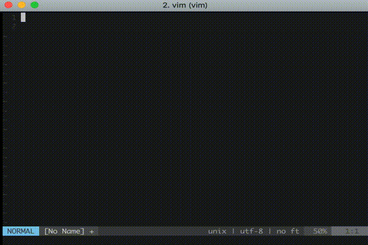

# leet.vim
Implements leetspeak converter at Vimscript<br>
This is created to learn Vimscript.


## Demo




## Install and Usage

### Plug Install

1. Add `.vimrc`

```vim
Plug 'shinshin86/leet.vim'
```

2. PlugInstall

   launch to vim then `:PlugInstall`

3. Let's leetspeak!

   launch to vim then `:Leet hello`


## Development

1. In terminal

```bash
git clone https://github.com/shinshin86/leet.vim.git
cd leet.vim
vim
```

2. In vim

```vim
" 1. read vim file
:source plugin/leet.vim

" 2. insert leet text
:Leet hello

" => insert text "[-]€el1p"
```

## About string for leet conversion

As for the string for leet conversion, I using the string described in this page.

[Wikipedia(Ja) - Leet](https://ja.wikipedia.org/wiki/Leet)

## Licence

MIT & [CC-BY-SA 3.0](https://creativecommons.org/licenses/by-sa/3.0/legalcode)

In the getLeetList function, character combinations taken from Wikipedia are used. For this reason, only this function is CC-BY-SA 3.0 Licence.

## Author

[Yuki Shindo](https://shinshin86.com/en)